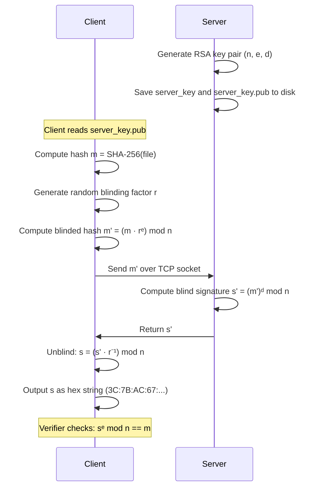

# Blind Signature Protocol

A Python implementation of **Chaum's RSA Blind Signature scheme** in a client-server architecture using TCP sockets. The server signs messages without ever learning their content — a core cryptographic primitive used in e-voting systems, digital cash, and anonymous credential schemes.

---

## What is a Blind Signature?

A blind signature allows a client to obtain a valid signature from a server on a message of its choice, **without the server learning what it is signing**. The server cannot later link a given signature to the session that produced it — this property is called *unlinkability*.

The scheme is based on the **multiplicative homomorphic property of RSA**:

```
(m · rᵉ)ᵈ ≡ mᵈ · r   (mod n)
```

This allows the client to embed a random blinding factor `r` into the message before sending it, then remove it from the server's response to recover a valid signature on the original message.

---

## Protocol Flow



---

## Security Properties

| Property | Description |
|---|---|
| **Blindness** | The server sees only `m'`, a random-looking value. It learns nothing about `m`. |
| **Unlinkability** | Given a signature `s`, the server cannot determine which session produced it. |
| **Unforgeability** | Only the server holding the private key `d` can produce valid signatures. |
| **Verifiability** | Anyone with the public key `(n, e)` can verify a signature independently. |

---

## Project Structure

```
blind-signature-protocol/
├── src/
│   ├── common/
│   │   └── crypto_utils.py       # Shared: hashing and key loading
│   ├── server/
│   │   └── server_signature.py   # RSA key generation + signing server
│   ├── client/
│   │   └── client_signature.py   # Blinding, communication and unblinding
│   └── verifier/
│       └── signature_verifier.py # Standalone signature verifier
├── tests/
│   └── test_protocol.py          # End-to-end and edge case tests
├── docs/
│   ├── protocol.md               # In-depth protocol explanation
│   └── design.md                 # Technical design decisions
├── requirements.txt
└── README.md
```

---

## Requirements

- Python 3.13+
- Linux or macOS

Install dependencies:

```bash
pip install -r requirements.txt
```

---

## Usage

### 1. Start the server

```bash
python3 src/server/server_signature.py
```

On first run, the server generates a 2048-bit RSA key pair and saves it to `server_key` (private) and `server_key.pub` (public). It then listens on `127.0.0.1:65432` for incoming signing requests.

```
Generating 2048-bit RSA key...
Keys saved successfully in 'server_key' and 'server_key.pub'.
Server listening on 127.0.0.1:65432
```

### 2. Request a blind signature

In a separate terminal:

```bash
python3 src/client/client_signature.py <original_file> <server_key.pub> > signature.txt
```

Example:

```bash
python3 src/client/client_signature.py document.pdf server_key.pub > signature.txt
```

The client hashes the file, blinds the hash, sends it to the server, receives the blind signature, unblinds it, and writes the result to `signature.txt` in hex format:

```
3C:7B:AC:67:F1:29:...
```

### 3. Verify the signature

```bash
python3 src/verifier/signature_verifier.py <original_file> <signature.txt> <server_key.pub>
```

Example:

```bash
python3 src/verifier/signature_verifier.py document.pdf signature.txt server_key.pub
```

Output:

```
FIRMA VÁLIDA
```

or

```
FIRMA NO VÁLIDA
```

---

## End-to-End Example

```bash
# Terminal 1 — start the server
python3 src/server/server_signature.py

# Terminal 2 — sign a file and verify it
echo "Hello, blind world!" > test.txt
python3 src/client/client_signature.py test.txt server_key.pub > signature.txt
python3 src/verifier/signature_verifier.py test.txt signature.txt server_key.pub
# → FIRMA VÁLIDA

# Tamper with the file and verify again
echo "Tampered content" > test.txt
python3 src/verifier/signature_verifier.py test.txt signature.txt server_key.pub
# → FIRMA NO VÁLIDA
```

---

## Technical Decisions

**Why RSA for blind signatures?**
RSA's multiplicative homomorphic property makes blinding natural: `(m · rᵉ)ᵈ = mᵈ · r mod n`. This allows clean unblinding without any interaction beyond a single message exchange.

**Key size: 2048 bits**
1024-bit RSA is considered broken per current NIST guidance. 4096-bit adds computational overhead without meaningful benefit for this demonstration. 2048-bit is the current recommended minimum for production use.

**SHA-256 for hashing**
The file is hashed before blinding for two reasons: it reduces any arbitrary-length input to a fixed 256-bit integer, and it ensures the signed value is a digest of the content rather than raw bytes. With a 2048-bit modulus, the hash value is always smaller than `n`, so no truncation or padding is needed.

**`secrets` module for blinding factor**
Python's `random` module is not cryptographically secure. The blinding factor `r` must be unpredictable — a weak RNG would allow the server to brute-force the factor and recover the original message. `secrets.randbelow` draws from the OS CSPRNG.

**Plain TCP sockets**
The socket channel is unencrypted. In a production deployment, the connection would require mutual TLS to prevent man-in-the-middle attacks on the public key exchange. This implementation assumes a trusted local network.

**No password on the private key**
The private key is stored unencrypted on disk for simplicity. In production, the key would be encrypted with a passphrase or stored in a hardware security module (HSM).

---

## Known Limitations

- Single-threaded server: handles one connection at a time. Concurrent clients would require threading or async I/O.
- No rate limiting: an unlimited number of signing requests can be made. A real deployment would enforce per-client quotas.
- Local network only: `HOST` defaults to `127.0.0.1`. Changing this without adding TLS exposes the signing key to network-level attacks.
- No replay protection: a captured `m'` could be replayed. A nonce or session token would prevent this.

---

## Running Tests

```bash
python3 -m pytest tests/ -v
```

---

## References

- Chaum, D. (1983). *Blind signatures for untraceable payments*. Advances in Cryptology, Crypto 82.
- Boneh, D. & Shoup, V. *A Graduate Course in Applied Cryptography* — Chapter 13: Digital Signatures. [https://toc.cryptobook.us](https://toc.cryptobook.us)
- Python `cryptography` library — [https://cryptography.io](https://cryptography.io)
- NIST SP 800-131A Rev. 2 — Transitioning the Use of Cryptographic Algorithms and Key Lengths.

---

## License

MIT License — see [LICENSE](LICENSE) for details.
